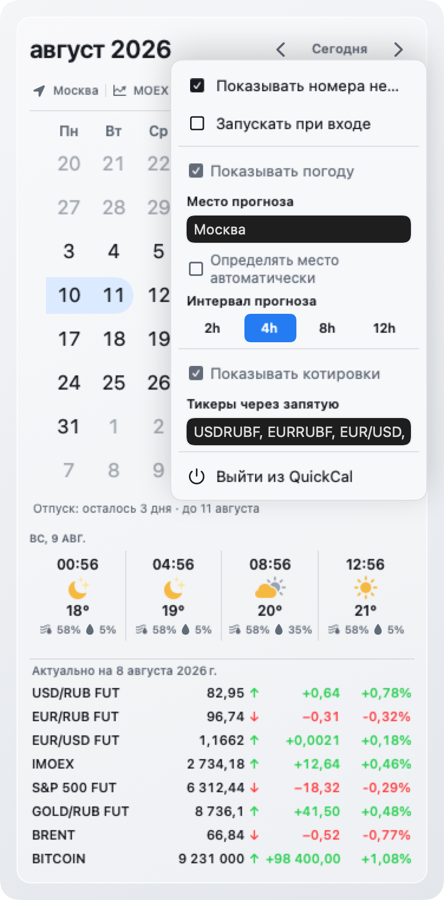

# QuickCal

QuickCal — локальный календарь в строке меню macOS. Он открывается компактным popover поверх текущего приложения: можно быстро проверить дату, рабочий или выходной день, отмеченный отпуск, прогноз погоды и рыночную сводку — без отдельного окна календаря.

## Актуальный релиз

Текущая версия: **2.3** (build `10`). В ней добавлено локальное расписание спринтов с паузами и отображением номеров в календаре.

- Полный список изменений: [QuickCal 2.3 — Спринты в календаре](docs/releases/v2.3.md).
- Локальный arm64-архив после сборки: `dist/QuickCal-v2.3-arm64.zip`.
- SHA-256 текущего архива: `34a3ff648288e5362f43768380f17ea1f41841e515b21083395082e73680f613`.

## Что умеет

### Календарь и отпуск

- Показывает производственный календарь России: рабочие дни, выходные и праздничные переносы.
- Поддерживает номера недель, дополнительные недели в начале и конце месяца, а также навигацию по месяцам и возврат к сегодняшней дате.
- Позволяет отмечать отдельные даты и непрерывные периоды. Выбранные соседние даты объединяются в один отпуск даже при переходе через неделю, месяц или год.
- Показывает рядом с календарём локализованный отсчёт: дни до ближайшего отпуска, дни до окончания либо последний день отпуска.
- Позволяет включить локальное расписание спринтов. По умолчанию функция выключена; дата старта может приходиться на любой день недели.
- Базовая длина спринта — 14 календарных дней. Для отдельных спринтов доступны 7, 14, 21 дней и произвольная положительная длина.
- Поддерживает паузы на произвольные даты: в эти дни спринта нет. Паузы можно удалить; при увеличении длительности спринта перекрытые даты паузы снова входят в спринт.
- Показывает компактную колонку номеров спринтов рядом с номерами недель: один номер, переход между номерами или тире для паузы. Нажатие на номер открывает редактор этого спринта, где отображается его фактическая длина с учётом пауз.
- Подсвечивает дни текущего спринта мягкой заливкой, не перекрывая смысл состояний «сегодня», «выбрано» и «выходной».

### Погода

- Показывает почасовой прогноз для выбранного города или текущего местоположения после явного включения автоматической геолокации.
- Группирует прогноз по дням, даёт переключать интервал и листать данные колёсиком мыши.
- Обновляет данные в общем цикле раз в 30 минут и сохраняет последний доступный прогноз при временной недоступности сети.

### Котировки

- Включается в дополнительных настройках и отображается под погодой.
- Принимает список тикеров через запятую: значения нормализуются, дубликаты удаляются, порядок пользователя сохраняется.
- По умолчанию показывает USD/RUB FUT, EUR/RUB FUT, EUR/USD, IMOEX, S&P 500 FUT, золото в рублях, Brent и Bitcoin (индекс MOEX).
- Для Brent автоматически выбирает ближайший неистёкший фьючерсный контракт; для EUR/USD — актуальную серию фьючерса MOEX.
- Для каждого инструмента выводит цену, стрелку направления рядом с ценой, абсолютное и процентное изменение за день. Числовые колонки выровнены для быстрого сравнения.
- Указывает дату актуальности рыночных данных, сохраняет последние успешные значения и честно показывает загрузку, частичную недоступность или устаревший кеш.

> `SP500F` основан на фиксинге MOEX SPY ETF, а Bitcoin отображается как индекс MOEXBTC, а не как котировка конкретной криптобиржи.

### Оформление и доступность

- 16 тем: восемь визуальных семейств в светлом и тёмном вариантах.
- Русская и английская локализации.
- Смысл состояний не передаётся только цветом: для котировок используются стрелки и знаки изменения, для календаря — отдельные маркеры сегодняшнего дня, выбора и выходного.
- Дополнительные настройки: номера недель, спринты, запуск при входе, погода и котировки. Настройки спринтов скрываются, пока `Show Sprints` выключен; длинное меню прокручивается.

## Интерфейс

<p align="center">
  
  
</p>

## Требования

- macOS 14 или новее;
- Apple Silicon (`arm64`);
- Swift 6 command line tools.

## Сборка

```bash
./Scripts/build-app.sh
```

Готовое приложение появится в `dist/QuickCal.app`.

Скрипт сначала собирает приложение с default macOS SDK, выбранным `xcrun`. Если такая сборка не проходит, он проверяет соседние установленные `MacOSX*.sdk` минимальным `swiftc -typecheck` probe и повторяет сборку с первым совместимым SDK. Чтобы использовать конкретный SDK без автоматического fallback, задайте его явно:

```bash
SDKROOT="$(xcrun --sdk macosx --show-sdk-path)" ./Scripts/build-app.sh
```

## Проверки

Канонический полный прогон:

```bash
./Scripts/test.sh
```

Команда сначала проверяет поведение сборочного скрипта в изолированном временном проекте, затем запускает Apple Swift Testing suite и валидирует xUnit-отчёт: должен быть выполнен хотя бы один тест, без ошибок и падений.

## Установка

Скопируйте `dist/QuickCal.app` в `/Applications`, затем откройте его. Запуск из `/Applications` нужен для штатной регистрации опции «Запускать при входе».

## Удаление

Сначала выключите «Запускать при входе» внутри QuickCal и завершите приложение, затем удалите `/Applications/QuickCal.app`.
